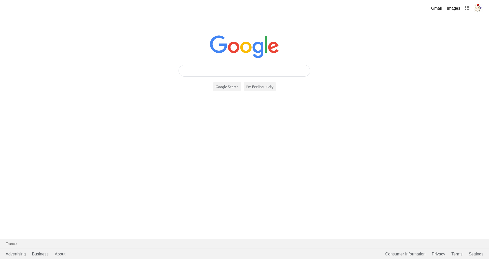

# Google Homepage

This is a visual clone of what [the Google homepage](https://www.google.com) was in 2019, made as part of
[The Odin Project's web development 101
course](https://www.theodinproject.com/courses/web-development-101/lessons/html-css), to become acquainted with HTML and CSS.

## Usage

- [Visit this link to see the page](https://lcyne.github.io/google-homepage/)
- Observe to your heart's content

## Structure

The project follows the structure explained in [this MDN article](https://developer.mozilla.org/en-US/docs/Learn/Getting_started_with_the_web/Dealing_with_files).
- [images/](./images): logos and icons for the page, and the screenshot for this README file
- [styles/](./styles): [Eric Mayer's CSS reset](https://meyerweb.com/eric/tools/css/reset/) and my own CSS
- [index.html](./index.html): all the HTML code

## License

This project is licensed under the [MIT license](./LICENSE).
